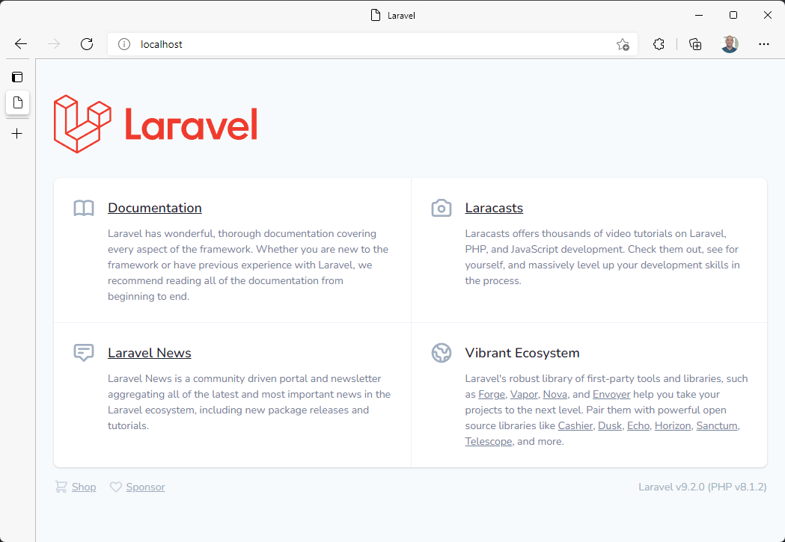
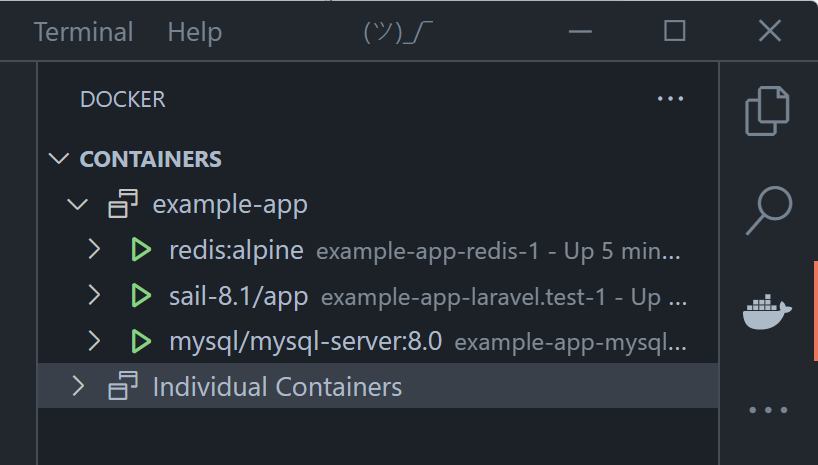
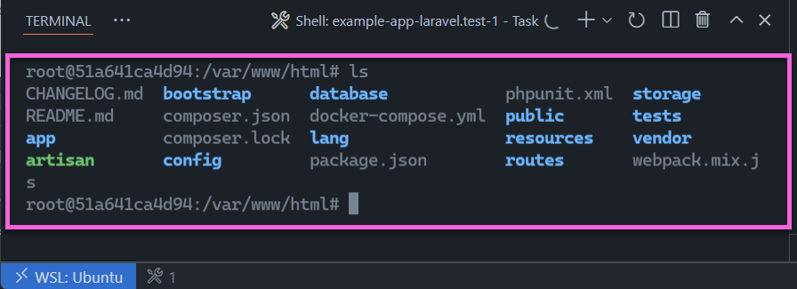
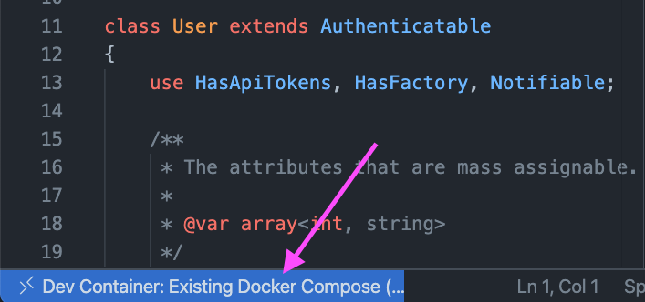
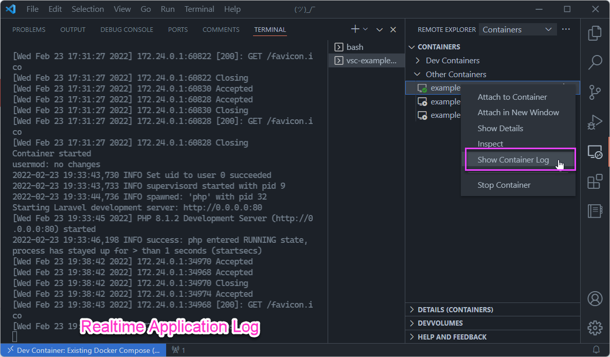

# Solving the "Tutorial" problem

Writing a great tutorial ain't easy. I should know - I've written a lot of them, and not every one was a smashing success.

As a case in point, our very own tutorial on [how to use Remote Containers in Visual Studio Code](https://docs.microsoft.com/en-us/learn/modules/use-docker-container-dev-env-vs-code/) has long had low completion rates - somewhere in the neighborhood of 4 - 6%. To figure out where people were giving up, we conducted user studies - which is where someone goes through the tutorial while we observe their progress.

During these user studies it became immediately clear to us why people weren't able to complete the tutorial: **Nobody was** **reading it**.

## Nobody reads

When I was in school, they gave us a test called, "[Following Directions](https://www.uen.org/lessonplan/download/44825?lessonId=27659&segmentTypeId=2)". It's a timed test with about 15 or so questions with various problems or puzzles. They gave us 5 minutes to complete the test. The questions were not easy, so you had to get right to it in order to finish in the allotted time. The instructions at the very top of the test said to "read the entire test before starting it". You only have 5 minutes so it's a pure waste of time to *read* the entire test first. Except, burried somewhere down towards the end of the test, one of the questions says, "Skip all questions and only complete number 3". In my recollection, only 2 students out of the entire class got this assignment correct; which was precisely the point of the exercise.

It is natural human behvavior to skip over explanatory text and begin with solutions straight away. I can relate to this. When I'm doing tutorials, my eyes are scanning for blocks of code because I'm pretty sure if you just tell me what to do next, I can figure out the *why* myself. And yet, when I'm writing tutorials, I somehow forget that and go full Tolstoy.

Back to our own tutorial - we watched as people would get stuck on some detail that was clearly explained right above the step they were trying to complete. What's worse is that the more text that a page had on it, the more likely people were to ignore it.

What we learned is that **if you want people to be successful with your tutorial, you need to remove as much of that tutorial as possible**. Tell people only what they need to know to be successful and either delete or abstract away as many things as you possibly can.

One of ways you can pair down your own tutorials is to completely remove any environment setup steps using preconfigured container dev environments.

## Containerized Dev Environments

A significant chunk of any tutorial is usually dedicated to a laundry list of pre-requisites and environment setup. I distinctly recall trying to learn Ruby on Rails and spending most of the time trying to get Ruby installed correctly on Windows - wondering what in the world a "gem" was and why they were all somehow missing.

The idea behind containerized dev environments is that you develop inside of a Docker container. This makes it possible to have a completely portable, fully configured development environment that you can stand up or knock down at will. You could then give that entire environment to someone as nothing more than a set of configuration files.

But how do you develop INSIDE of a container? It's not like containers have a UI where you can just launch VS Code.

The [Remote-Containers](https://marketplace.visualstudio.com/items?itemName=ms-vscode-remote.remote-containers) [extension for VS Code](https://marketplace.visualstudio.com/items?itemName=ms-vscode-remote.remote-containers) does exactly this. It contains both the mechanism for configuring a Docker container as a dev environment, as well as allowing you to connect to that environment from VS Code. It does this by installing a small server component within the container that your local VS Code talks to. You then develop just like you would if you were local, but VS Code is attached to the container environment instead of your local environment.

In order to create a containerized dev environment, you would ordinarily have to know a thing or two about Docker. A lot of people do, but  a lot of people *don't* (you can't see me, but my hand is in the air), so the extension tries to abstract the container setup process away as much as possible. For instance, here I set up a new Python container and then add the Azure CLI, the Dotnet CLI and Powershell...

This process adds a ".devcontainer" folder to this project with the necessary "Dockerfile" included. It also adds a "devcontainer.json" file, which is a standard for defining aspects of a dev container, like which extensions should be installed, which setup commands should be run after container build, etc. Since you have complete control over the environment and its setup, you can automate pretty much everything - including dependency installs, library versions, etc.

In this way, it's possible to quite literally hand someone a complete, ready-to-use environment that requires no additional setup steps or triggering of existential crisis over Ruby gems.

Some folks are already using a dev container based approach to get their users up and running quickly with what are otherwise very complex environments. A great example of this is the [Laravel framework for PHP](https://laravel.com/docs/9.x).

## The Laravel Solution

Laravel is an open-source MVC framework for PHP. It's comprehensive in the sense that it also includes things like an Object Relational Mapper (ORM), direct database access, a packaging system and more. Laravel can do a lot. And in order to experience it, you really need to have at least a database when you're getting started. Normally this would require the user to install not just PHP, but a database as well - usually MySQL. That's a significant ask when a user is simply trying your framework on for size.

Laravel addresses this with containerized dev environments and a tool called [Sail](https://github.com/laravel/sail). In order to get started from scratch with Laravel, a MySQL Server and a Redis Cache, you only have to run a single command...

    curl -s "https://laravel.build/example-app?with=mysql,redis" | bash

This creates a new project with a "docker-compose" file. This file sets up 3 containers - an application container, a MySQL container and a Redis container. You don't have to know anything about containers or any of those 3 services. Sail abstracts all of this away for you. You then execute the Sail command to spin up the environment...

     ./vendor/bin/sail up

The sample application just runs. No installing PHP. No Laravel. No dependency resolutions steps. Just immediate success.

I specified that our project has a MySQL Server and a Redis Cache, so we actually get 3 containers when the project spins up. We can see that using the [Docker extension for VS Code](https://marketplace.visualstudio.com/items?itemName=ms-azuretools.vscode-docker&WT.mc_id=devcloud-0000-cxa).

These containers are networked together so that we can call the MySQL or Redis cache containers from the app container.

If you inspect the app container, you'll see your project in the /var/www/html folder. Because Docker "mounts" the project from your machine into the container, any changes you make while developing are reflected in the application when you refresh.

## Adding Remote Containers

Support has also been added for the [Remote-Containers extension](https://marketplace.visualstudio.com/items?itemName=ms-vscode-remote.remote-containers). To add the proper dev container configuration to this project, you can scaffold the same project and add the "&devcontainer" flag.

    curl -s "https://laravel.build/example-app?with=mysql,redis&devcontainer" | bash

> Note that if you want to add a devcontainer to an existing Sail/Laravel project, you can do that by running `php artisan sail:install --devcontainer`

This creates the same project configuration, but will include a ".devcontainer" folder. VS Code will automatically detect that folder and prompt you to reopen the project in a container thereby skipping the required `sail up` step.

In this case, VS Code attaches to the container so you are developing *within* the container environment as opposed to your local one. You'll know that beause the Remote Indicator in the left-hand corner of VS Code tells you so...

Developing in the container as opposed to outside of it has some distinct benefits.

**Development context mirrors app context**
When connected to the container, the context you are developing in is the same as the one where the application is running. So your terminal becomes the terminal of the container...=

Remote-Containers also gives you a more complete view of what's going on, like which ports are forwarded - just in case you forget where your application is running.

The Laravel application starts automatically and the application logs are piped to the container logs. Since you probably want to see what's going on in the application, The Remote-Containers extension provides a new view in VS Code where you can see all running containers, as well as connect to a stream container logs.

**Automate the dev environment setup**
The best possible developer experience is going to include customizations for the editor. This includes settings for the editor itself, and any extensions or other support that needs to be added to the out-of-the-box experience.

For VS Code and Laravel, extensions are suggested in the "devcontainer.json", but commented out so that they are not installed automatically. This allows the user to pick from a set of already identified extensions instead of having to go hunt for the right way to configure their editor.

    ...
    "extensions": [
        // "mikestead.dotenv",
        // "amiralizadeh9480.laravel-extra-intellisense",
        // "ryannaddy.laravel-artisan",
        // "onecentlin.laravel5-snippets",
        // "onecentlin.laravel-blade"
    ],

# Read less, do more

People don't read. And that should be OK. Laravel's tutorials aren't necessarily shorter than any others, but the important thing is that if you read none of it and just run the commands, it works. Dev containers make this possible. Now if only we could figure out how to make a dev container for our dev container tutorial...

